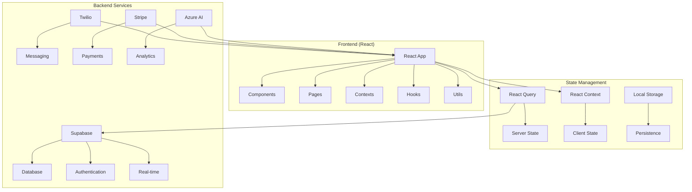
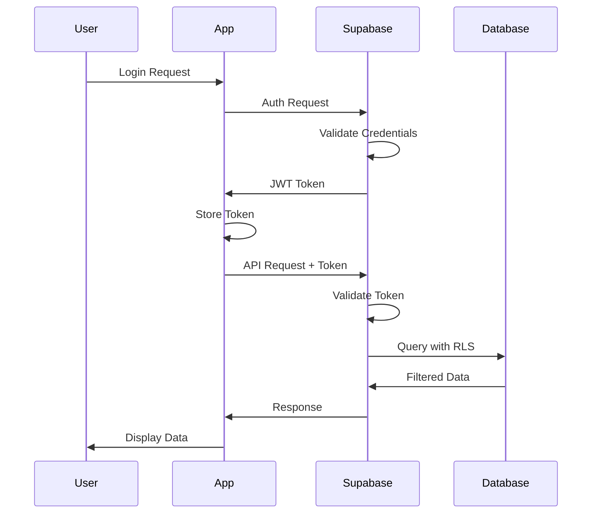

# Architecture Overview 🏗️

ClinicBoost is built using modern web technologies with a focus on scalability, maintainability, and performance. This document provides a comprehensive overview of the system architecture.

## 🎯 Architecture Principles

### 1. **Separation of Concerns**
- Clear separation between UI, business logic, and data layers
- Modular component architecture
- Service-oriented design patterns

### 2. **Scalability**
- Horizontal scaling capabilities
- Efficient state management
- Optimized data fetching and caching

### 3. **Maintainability**
- TypeScript for type safety
- Consistent code patterns
- Comprehensive testing coverage

### 4. **Performance**
- Lazy loading and code splitting
- Optimistic updates
- Efficient re-rendering strategies

## 🏛️ High-Level Architecture



## 📁 Project Structure

```
src/
├── components/              # Reusable UI components
│   ├── ui/                 # Base UI components
│   ├── patients/           # Patient-specific components
│   ├── appointments/       # Appointment components
│   ├── billing/           # Billing components
│   ├── campaigns/         # Campaign components
│   ├── compliance/        # Compliance components
│   ├── backup/            # Backup & recovery components
│   └── accessibility/     # Accessibility components
├── pages/                  # Page components
│   ├── Dashboard.tsx
│   ├── Patients.tsx
│   ├── Appointments.tsx
│   ├── Billing.tsx
│   └── ...
├── layouts/               # Layout components
│   ├── DashboardLayout.tsx
│   └── AuthLayout.tsx
├── contexts/              # React contexts
│   ├── AuthContext.tsx
│   ├── ThemeContext.tsx
│   ├── ClinicContext.tsx
│   └── OfflineContext.tsx
├── hooks/                 # Custom React hooks
│   ├── usePatients.ts
│   ├── useAppointments.ts
│   ├── useAuth.ts
│   └── ...
├── lib/                   # Utilities and configurations
│   ├── api/              # API functions
│   ├── supabase.ts       # Supabase client
│   ├── react-query.ts    # React Query config
│   ├── validation/       # Schema validation
│   └── integrations/     # Third-party integrations
├── utils/                 # Helper functions
│   ├── cn.ts            # Class name utility
│   ├── date.ts          # Date utilities
│   └── format.ts        # Formatting utilities
├── i18n/                 # Internationalization
│   ├── i18n.ts          # i18n configuration
│   └── locales/         # Translation files
├── styles/               # Global styles
└── test/                 # Test utilities and mocks
```

## 🔧 Technology Stack

### Frontend
- **React 18**: UI library with concurrent features
- **TypeScript**: Type safety and developer experience
- **Tailwind CSS**: Utility-first CSS framework
- **React Router**: Client-side routing
- **React Hook Form**: Form management
- **React Query**: Server state management

### Backend Services
- **Supabase**: Backend-as-a-Service
  - PostgreSQL database
  - Authentication
  - Real-time subscriptions
  - Row Level Security (RLS)
- **Twilio**: SMS and WhatsApp messaging
- **Stripe**: Payment processing
- **Azure AI**: Text analytics and insights

### Development Tools
- **Vite**: Build tool and dev server
- **ESLint**: Code linting
- **Prettier**: Code formatting
- **Vitest**: Unit testing
- **Playwright**: E2E testing
- **TypeScript**: Static type checking

## 🔄 Data Flow

### 1. **User Interaction**
```typescript
// User clicks button
<Button onClick={handleCreatePatient}>
  Add Patient
</Button>

// Event handler
const handleCreatePatient = () => {
  setShowModal(true);
};
```

### 2. **Form Submission**
```typescript
// Form submission with validation
const { mutate: createPatient } = useCreatePatient();

const onSubmit = (data: PatientFormData) => {
  createPatient(data, {
    onSuccess: () => {
      toast.success('Patient created successfully');
      queryClient.invalidateQueries(['patients']);
    },
    onError: (error) => {
      toast.error(error.message);
    }
  });
};
```

### 3. **API Call**
```typescript
// API function
export const createPatient = async (patient: PatientInsert) => {
  const { data, error } = await supabase
    .from('patients')
    .insert(patient)
    .select()
    .single();

  if (error) throw error;
  return data;
};
```

### 4. **State Update**
```typescript
// React Query handles caching and updates
const { data: patients, isLoading } = useQuery({
  queryKey: ['patients', clinicId],
  queryFn: () => getPatients(clinicId),
  staleTime: 5 * 60 * 1000, // 5 minutes
});
```

## 🎨 Component Architecture

### Component Hierarchy
```
App
├── AuthProvider
├── ThemeProvider
├── ClinicProvider
├── OfflineProvider
└── QueryClientProvider
    ├── DashboardLayout
    │   ├── Header
    │   ├── Sidebar
    │   └── MainContent
    │       └── Page Components
    └── AuthLayout
        └── Auth Components
```

### Component Patterns

#### 1. **Container/Presentational Pattern**
```typescript
// Container Component (Logic)
const PatientListContainer = () => {
  const { data: patients, isLoading } = usePatients();
  const { mutate: deletePatient } = useDeletePatient();

  return (
    <PatientList
      patients={patients}
      isLoading={isLoading}
      onDelete={deletePatient}
    />
  );
};

// Presentational Component (UI)
interface PatientListProps {
  patients: Patient[];
  isLoading: boolean;
  onDelete: (id: string) => void;
}

const PatientList: React.FC<PatientListProps> = ({
  patients,
  isLoading,
  onDelete
}) => {
  // Pure UI rendering
};
```

#### 2. **Compound Component Pattern**
```typescript
// Modal compound component
<Modal>
  <Modal.Header>
    <Modal.Title>Add Patient</Modal.Title>
  </Modal.Header>
  <Modal.Body>
    <PatientForm />
  </Modal.Body>
  <Modal.Footer>
    <Button variant="secondary">Cancel</Button>
    <Button variant="primary">Save</Button>
  </Modal.Footer>
</Modal>
```

#### 3. **Render Props Pattern**
```typescript
// Data fetching component
<DataFetcher
  queryKey={['patients']}
  queryFn={getPatients}
  render={({ data, isLoading, error }) => (
    <PatientList
      patients={data}
      isLoading={isLoading}
      error={error}
    />
  )}
/>
```

## 🔐 Security Architecture

### Authentication Flow


### Row Level Security (RLS)
```sql
-- Patients table RLS policy
CREATE POLICY "Users can only see patients from their clinic"
ON patients FOR ALL
USING (clinic_id IN (
  SELECT clinic_id FROM user_clinic_memberships
  WHERE user_id = auth.uid()
));
```

## 📊 State Management

### Server State (React Query)
```typescript
// Query configuration
const queryClient = new QueryClient({
  defaultOptions: {
    queries: {
      staleTime: 5 * 60 * 1000, // 5 minutes
      gcTime: 10 * 60 * 1000,   // 10 minutes
      retry: 3,
      refetchOnWindowFocus: false,
    },
  },
});

// Custom hook
export const usePatients = () => {
  const clinicId = useCurrentClinicId();
  
  return useQuery({
    queryKey: ['patients', clinicId],
    queryFn: () => getPatients(clinicId),
    enabled: !!clinicId,
  });
};
```

### Client State (React Context)
```typescript
// Theme context
interface ThemeContextType {
  theme: 'light' | 'dark';
  toggleTheme: () => void;
}

const ThemeContext = createContext<ThemeContextType | undefined>(undefined);

export const ThemeProvider: React.FC<{ children: ReactNode }> = ({ children }) => {
  const [theme, setTheme] = useState<'light' | 'dark'>('light');

  const toggleTheme = () => {
    setTheme(prev => prev === 'light' ? 'dark' : 'light');
  };

  return (
    <ThemeContext.Provider value={{ theme, toggleTheme }}>
      {children}
    </ThemeContext.Provider>
  );
};
```

## 🌐 Internationalization

### i18n Architecture
```typescript
// i18n configuration
import i18n from 'i18next';
import { initReactI18next } from 'react-i18next';
import LanguageDetector from 'i18next-browser-languagedetector';

i18n
  .use(LanguageDetector)
  .use(initReactI18next)
  .init({
    resources: {
      en: { translation: enTranslations },
      ar: { translation: arTranslations },
      fr: { translation: frTranslations },
    },
    fallbackLng: 'en',
    interpolation: {
      escapeValue: false,
    },
  });
```

### RTL Support
```css
/* RTL styles */
[dir="rtl"] {
  .sidebar {
    right: 0;
    left: auto;
  }
  
  .text-left {
    text-align: right;
  }
}
```

## 🚀 Performance Optimizations

### Code Splitting
```typescript
// Lazy loading pages
const Dashboard = lazy(() => import('./pages/Dashboard'));
const Patients = lazy(() => import('./pages/Patients'));

// Route-based splitting
<Routes>
  <Route path="/dashboard" element={
    <Suspense fallback={<Loading />}>
      <Dashboard />
    </Suspense>
  } />
</Routes>
```

### Memoization
```typescript
// Component memoization
const PatientCard = React.memo<PatientCardProps>(({ patient, onEdit }) => {
  return (
    <div className="patient-card">
      {/* Patient card content */}
    </div>
  );
});

// Hook memoization
const usePatientStats = (patients: Patient[]) => {
  return useMemo(() => {
    return {
      total: patients.length,
      active: patients.filter(p => p.status === 'active').length,
      // ... other stats
    };
  }, [patients]);
};
```

### Virtual Scrolling
```typescript
// Large list optimization
import { FixedSizeList as List } from 'react-window';

const PatientList = ({ patients }: { patients: Patient[] }) => (
  <List
    height={600}
    itemCount={patients.length}
    itemSize={80}
    itemData={patients}
  >
    {PatientRow}
  </List>
);
```

## 🔄 Real-time Features

### Supabase Subscriptions
```typescript
// Real-time appointments
useEffect(() => {
  const subscription = supabase
    .channel('appointments')
    .on('postgres_changes', {
      event: '*',
      schema: 'public',
      table: 'appointments',
      filter: `clinic_id=eq.${clinicId}`
    }, (payload) => {
      queryClient.invalidateQueries(['appointments']);
    })
    .subscribe();

  return () => {
    subscription.unsubscribe();
  };
}, [clinicId]);
```

## 📱 Offline Support

### Service Worker
```typescript
// PWA configuration
import { registerSW } from 'virtual:pwa-register';

const updateSW = registerSW({
  onNeedRefresh() {
    // Show update available notification
  },
  onOfflineReady() {
    // Show offline ready notification
  },
});
```

### Offline Data Management
```typescript
// Offline-first queries
const { data: patients } = useQuery({
  queryKey: ['patients', clinicId],
  queryFn: () => offlinePatientService.getPatients(clinicId),
  networkMode: 'offlineFirst',
});
```

## 🧪 Testing Architecture

### Testing Pyramid
```
E2E Tests (Playwright)
    ↑
Integration Tests (Vitest)
    ↑
Unit Tests (Vitest + Testing Library)
```

### Test Structure
```typescript
// Component test
describe('PatientForm', () => {
  it('validates required fields', async () => {
    render(<PatientForm onSubmit={mockSubmit} />);
    
    await user.click(screen.getByRole('button', { name: /save/i }));
    
    expect(screen.getByText(/first name is required/i)).toBeInTheDocument();
  });
});
```

## 📈 Monitoring and Analytics

### Error Tracking
```typescript
// Sentry integration
import * as Sentry from '@sentry/react';

Sentry.init({
  dsn: process.env.VITE_SENTRY_DSN,
  environment: process.env.NODE_ENV,
});
```

### Performance Monitoring
```typescript
// Web Vitals
import { getCLS, getFID, getFCP, getLCP, getTTFB } from 'web-vitals';

getCLS(console.log);
getFID(console.log);
getFCP(console.log);
getLCP(console.log);
getTTFB(console.log);
```

---

*This architecture supports the current needs of ClinicBoost while providing flexibility for future growth and feature additions.*
